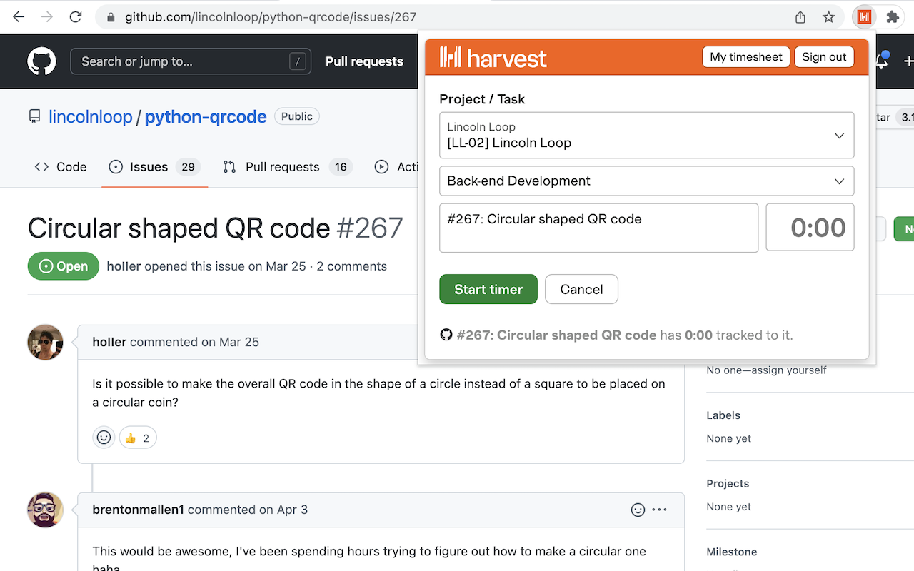

# Harvest Issue Board Plugin

This extension adds a Harvest time tracking button for Jira, Zammad, GitHub, and GitLab issues (active sprints page, issue page). No synchronization to the webpage is done, all data stays in Harvest.

 * [Chrome Store](https://chrome.google.com/webstore/detail/jira-harvest-time-trackin/klgljijecjfkdfobihclllkadmoeokgg)
 * [Mozilla Addons](https://addons.mozilla.org/de/firefox/addon/jira-harvest-helper)

# Usage
Select the ticket, then click on the extension icon in the upper right corner. A popup will open where you can specify project and task and set the desired starting time (which defaults to now). A permanent link to the selected issue will be added to the Harvest item automatically.

Earlier versions of this plugin displayed a time tracking button on Jira — this got removed. [Details](docs/on-page-tracker.md).

# Why this project was started

The official [harvest-jira](https://www.getharvest.com/apps-and-integrations/jira) integration is done via a Jira plugin — which might not be possible or desirable in some cases (for example you don't have an admin account on your client's Jira instance).

# Screenshot

# Install the development version
- Get the code:
  - Either clone this repo (`git clone git@github.com:ipmb/gr-harvest-helper.git`)
  - Or download as a zip and unzip it (`https://github.com/ipmb/gr-harvest-helper/archive/master.zip`)
- Go to Chrome's extensions page (`chrome://extensions/`)
- Disable the Chrome Store version of this extension (if installed)
- Enable developer mode via the toggle in the top right
- Click on "Load unpacked" (top left button) and choose the folder of the cloned repo

# Extracting Harvest Platform source

The app stores don't allow add-ons that link to third-party JavaScript. They also don't allow unobfuscated JavaScript without the source. `extract_harvest_source.sh` will extract the original source JavaScript from Harvest's source maps and apply a patch so it runs as-is. The result is saved to `src/vendor/harvestPlatform.js`.

# New Maintainer

This extension was created by [Grey Rook GmbH](https://www.greyrook.com/) and is no longer maintained. [Lincoln Loop](https://lincolnloop.com) forked the code to add GitHub support and make it compatible with current Chrome Web Store requirements.
